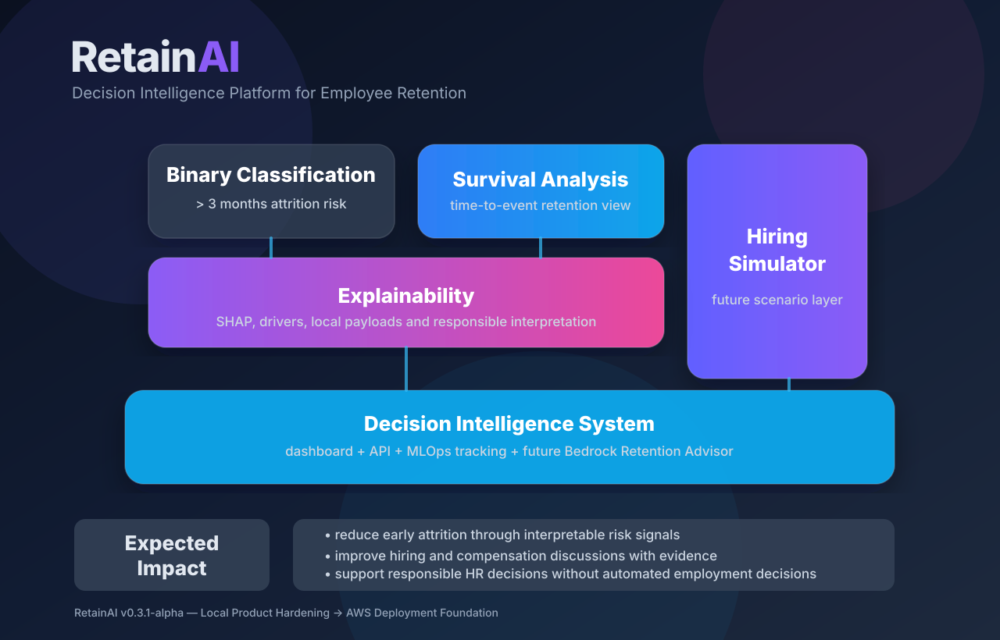
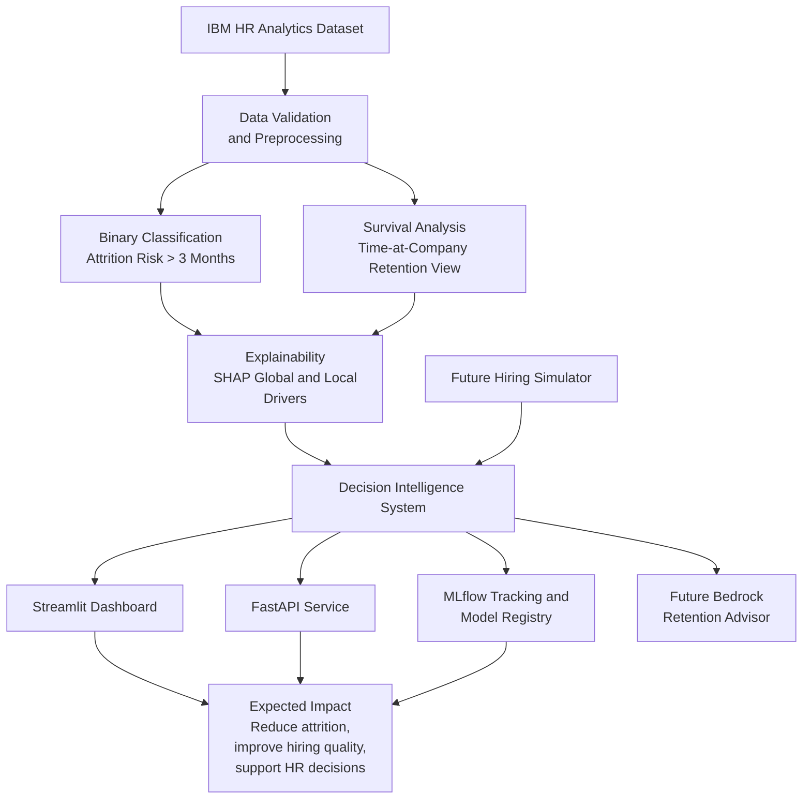

<p align="left">

<a href="https://www.python.org/" target="_blank">

</a>
<a href="https://scikit-learn.org/" target="_blank">

</a>
<a href="https://xgboost.readthedocs.io/" target="_blank">

</a>
<a href="https://lifelines.readthedocs.io/" target="_blank">

</a>
<a href="https://shap.readthedocs.io/" target="_blank">

</a>
<a href="https://mlflow.org/" target="_blank">

</a>
<a href="https://fastapi.tiangolo.com/" target="_blank">

</a>
<a href="https://streamlit.io/" target="_blank">

</a>
<a href="https://aws.amazon.com/" target="_blank">

</a>
<a href="https://www.pulumi.com/" target="_blank">

</a>
<a href="https://github.com/features/actions" target="_blank">

</a>
<a href="https://www.docker.com/" target="_blank">

</a>


</p>

# RetainAI

> Decision Intelligence Platform for Employee Retention

RetainAI is an end-to-end Machine Learning, Explainable AI and MLOps platform for employee retention analytics.

Rather than providing only employee attrition prediction, RetainAI combines predictive modeling, survival analysis, explainable AI, dashboard-driven decision support, reproducible experimentation and future AI-assisted retention guidance into a modular analytics platform for Human Resources.

---

## Project Vision

RetainAI is designed as a Decision Intelligence System for Human Resources.

The long-term objective is to evolve from traditional employee attrition prediction toward an explainable AI platform capable of supporting workforce planning, retention strategy design and responsible HR decision making.

The architecture is intentionally designed to evolve toward Amazon Bedrock-powered assistants without requiring major repository redesign.

---

## Concept Architecture

RetainAI is organized as a layered decision-intelligence system. The current local foundation already covers attrition classification, survival analysis, explainability, dashboard consumption, API services and MLOps tracking. The next AWS sprint will move this foundation toward S3-backed data, container deployment, Pulumi infrastructure and cloud artifact storage.

<p align="center">
  
</p>



### Analytical Layers

| Layer | Purpose | Current Status |
|---|---|---|
| Binary Classification | Predict employee attrition risk using supervised ML. | Available locally. |
| Survival Analysis | Estimate retention over time using `YearsAtCompany` as proxy duration. | Available locally. |
| Explainability | Explain global and row-level model behavior with SHAP and structured payloads. | Available locally. |
| Hiring Simulator | Simulate hiring and compensation scenarios. | Future extension. |
| Decision Intelligence System | Combine dashboard, API, MLOps tracking and future AI guidance. | Local foundation available. |

### Expected Impact

- Reduce early attrition through evidence-based risk signals.
- Improve hiring and compensation discussions with interpretable model outputs.
- Support HR decisions with transparent analytics and responsible AI boundaries.


---

## Current Capabilities

- Employee attrition classification.
- Survival analysis.
- Explainable AI with SHAP.
- Operational MLflow experiment tracking and local model versioning.
- Reproducible data acquisition and preprocessing pipeline.
- Declarative notebook workflow.
- Product-oriented Streamlit dashboard.
- FastAPI service foundation.
- Docker Compose local orchestration.
- Bedrock-ready structured explanation payload foundation.
- Retention Advisor prompt templates for future Bedrock integration.
- Local visual dashboard export foundation.
- Modular architecture for future AWS deployment.

---

## Analytical Pipeline

```text
Kaggle Dataset
        │
        ▼
Dataset Acquisition
        │
        ▼
Validation
        │
        ▼
Preprocessing
        │
        ▼
EDA
        │
        ▼
Classification
        │
        ▼
Survival Analysis
        │
        ▼
Explainability
        │
        ▼
Dashboard + API
        │
        ▼
Future Retention Advisor
```

---

## Repository Architecture

```text
RetainAI/
├── apps/
│   ├── api/
│   └── dashboard/
│       └── streamlit-app/
├── artifacts/
│   ├── dashboard/
│   ├── explanations/
│   ├── figures/
│   ├── models/
│   └── reports/
├── configs/
├── data/
├── docs/
│   ├── architecture/
│   ├── dashboard/
│   ├── data/
│   ├── eda/
│   ├── modeling/
│   └── prompts/
├── figs/
├── modules/
│   ├── classification/
│   ├── dashboard/
│   ├── eda/
│   ├── explainability/
│   ├── io/
│   ├── preprocessing/
│   └── survival/
├── notebooks/
├── requirements/
├── services/
│   ├── api/
│   ├── dashboard/
│   └── compose.yaml
├── src/
│   └── retainai/
├── tests/
├── pyproject.toml
└── tox.ini
```

The repository follows a layered architecture:

- `apps/` contains application code such as the FastAPI service and Streamlit dashboard.
- `services/` contains local container and Docker Compose definitions.
- `modules/` contains reusable analytical and dashboard logic.
- `src/retainai/` contains executable package pipelines.
- `notebooks/` remain declarative and consume reusable modules.
- `artifacts/` stores reproducible analytical outputs and generated local artifacts.
- `docs/` contains architecture, methodology and product documentation.
- `tests/` validates reusable logic, dashboard contracts and behavior-level expectations.

---

## Applications

### Streamlit Dashboard

The dashboard lives under:

```text
apps/dashboard/streamlit-app/
```

Current pages:

```text
Home
Executive Overview
Prediction Center
Explainability Explorer
Survival Analytics
Data Dictionary
```

Run locally:

```bash
streamlit run apps/dashboard/streamlit-app/app.py
```

### FastAPI Service

The API application lives under:

```text
apps/api/
```

Run locally:

```bash
uvicorn apps.api.main:app --host 0.0.0.0 --port 8001
```

Useful endpoints:

```text
/
 /health
/docs
/openapi.json
```

### Docker Compose

Run dashboard and API together:

```bash
docker compose -f services/compose.yaml down --remove-orphans || true
docker rm -f retainai-api retainai-dashboard || true
docker network prune -f
docker compose -f services/compose.yaml build --no-cache
docker compose -f services/compose.yaml up
```

Expected URLs:

```text
Dashboard: http://localhost:8501
API:       http://localhost:8001
API Docs:  http://localhost:8001/docs
Health:    http://localhost:8001/health
```

---

## Public Dataset

RetainAI uses the IBM HR Analytics Employee Attrition dataset as an initial benchmark.

The dataset is not redistributed by this repository.

Expected directory structure:

```text
data/
└── raw/
    └── ibm_hr_attrition/
        └── WA_Fn-UseC_-HR-Employee-Attrition.csv
```

Dataset download:

```bash
python -m retainai.data.download_ibm_hr
```

Manual download:

```bash
kaggle datasets download   -d pavansubhasht/ibm-hr-analytics-attrition-dataset   -p data/raw/ibm_hr_attrition   --unzip
```

Prepare processed datasets:

```bash
python -m retainai.data.prepare_dataset
python -m retainai.data.validate_dataset
```

---

## Main Pipelines

### EDA Report

```bash
python -m retainai.eda.generate_report
```

### Classification Training

```bash
python -m retainai.training.train_classification
```

### Survival Analysis

```bash
python -m retainai.survival.run_survival_analysis
```

### Explainability

```bash
python -m retainai.explainability.run_explainability
```


---

## MLOps Tracking and Model Versioning

RetainAI uses MLflow for local experiment tracking and model artifact versioning.

Training is configured through:

```text
configs/training.yaml
```

The classification training pipeline logs:

```text
parameters
metrics
model artifacts
model signatures
input examples
classification reports
registered model names
```

Run classification training with MLflow tracking:

```bash
python -m retainai.training.train_classification
```

Open the MLflow UI:

```bash
mlflow ui --backend-store-uri artifacts/mlflow --port 5000
```

Then open:

```text
http://localhost:5000
```

Model artifacts are stored in two complementary ways:

```text
artifacts/models/<model_name>.pkl
artifacts/mlflow/
```

RetainAI also maintains a lightweight local model registry manifest:

```text
artifacts/models/model_registry.json
```

Inspect the current model registry manifest:

```bash
python -m retainai.mlops.show_model_registry
```

The MLflow tracking design is documented in:

```text
docs/mlops/mlflow_tracking.md
```

---

## Development Environment

Recommended environment:

- Python 3.10.
- VS Code.
- Dev Containers.
- Docker.

The development container provides a reproducible Linux environment independent of the host operating system, avoiding common dependency issues on macOS and Windows.

Local virtual environment:

```bash
python3.10 -m venv .venv
. .venv/bin/activate

python -m pip install --upgrade pip setuptools wheel
python -m pip install -e ".[dev,test]"
```

Full development install:

```bash
python -m pip install -e ".[all]"
```

macOS compatibility note:

```bash
python -m pip install --no-cache-dir --only-binary=:all:   "llvmlite==0.43.0"   "numba==0.60.0"   "pyarrow==14.0.2"   "cryptography==45.0.7"
```

For SHAP, XGBoost and survival dependencies, the Dev Container is the recommended environment.

---

## Testing

Run the full suite:

```bash
python -m tox
```

Selected environments:

```bash
python -m tox -e lint
python -m tox -e format
python -m tox -e behavior
python -m tox -e survival
python -m tox -e explainability
```

---

## Project Status

Current development branch:

```text
feature/mlops-foundation
```

Completed milestones:

### v0.1

- Repository Foundation.
- Data Foundation.
- Exploratory Data Analysis.
- Classification Pipeline.
- Operational MLflow Tracking and Model Versioning.

### v0.2

- Survival Analysis.
- Explainability with SHAP.

### v0.3

- Streamlit Dashboard Foundation.
- FastAPI Service Foundation.
- Docker Compose Local Orchestration.
- Executive Overview.
- Prediction Center.
- Explainability Explorer.
- Survival Analytics.
- Data Dictionary.

### v0.3.1

- Local Product Hardening.
- Visual dashboard export foundation.
- API-backed prediction mode foundation.
- Retention Advisor prompt templates.
- Persisted explanation payload samples.
- MLflow tracking and local model versioning documentation.
- Dashboard/API local execution cleanup.

---

## Roadmap

### v0.3.1

- Visual dashboard export as PNG/PDF or ZIP bundle.
- API-backed prediction mode hardening.
- Retention Advisor prompt templates.
- Persisted explanation payload samples.
- Additional dashboard CSS refinements.
- Dashboard and API integration tests.

### v0.4

- AWS Deployment.
- Pulumi Infrastructure.
- S3-backed dashboard data source.
- Container deployment strategy.
- Cloud model/artifact storage strategy.

### v0.5

- Model Monitoring.
- Drift Detection.
- Automated Retraining.
- Dashboard validation reports.

### v1.0

- Resume Intelligence.
- Psychometric Intelligence.
- Amazon Bedrock Integration.
- Retention Advisor.

---

## Documentation

Architecture specifications:

```text
docs/architecture/
```

Modeling methodology:

```text
docs/modeling/
```

EDA documentation:

```text
docs/eda/
```

Dashboard documentation:

```text
docs/dashboard/
```

Prompt and AI-assistant documentation:

```text
docs/prompts/
```

---

## Author

- **Hubert Ronald** — Initial Work — [HubertRonald](https://github.com/HubertRonald)

## License

Distributed under the MIT License. See [LICENSE](./LICENSE) for more details.
