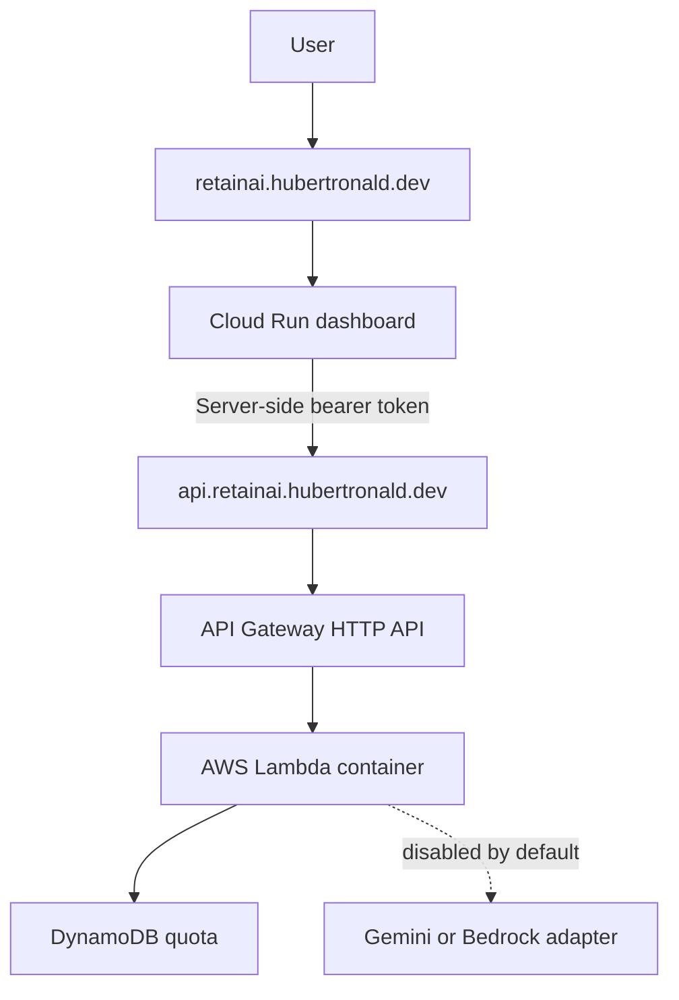

# RetainAI

**RetainAI** is a multicloud retention-intelligence platform combining
explainable analytics, secure serverless delivery, and bounded AI-assisted
decision support.

Product design, architecture, and AI-assisted development by
[Hubert Ronald](https://hubertronald.dev/).

## Live endpoints

| Surface | URL |
|---|---|
| Dashboard | <https://retainai.hubertronald.dev> |
| Backend API | <https://api.retainai.hubertronald.dev> |
| Portfolio | <https://hubertronald.dev> |

## Current release

`v0.4.0` establishes the multicloud product foundation:

- Cloud Run dashboard with branded HTTPS.
- API Gateway and Lambda container backend.
- Terraform-managed AWS and GCP infrastructure.
- Server-side bearer-token authentication.
- DynamoDB request quotas.
- AI providers disabled by default.
- Cloud Run scale-to-zero and maximum one instance.
- Application delivery separated from infrastructure delivery.

## Architecture

The browser never receives the backend bearer token.

## Documentation

| Area | Guide |
|---|---|
| Documentation index | [docs/README.md](docs/README.md) |
| Architecture | [docs/architecture/README.md](docs/architecture/README.md) |
| Dashboard | [docs/dashboard/README.md](docs/dashboard/README.md) |
| Data | [docs/data/README.md](docs/data/README.md) |
| Exploratory analysis | [docs/eda/README.md](docs/eda/README.md) |
| Modeling | [docs/modeling/README.md](docs/modeling/README.md) |
| MLOps | [docs/mlops/README.md](docs/mlops/README.md) |
| Multicloud delivery | [docs/multicloud/README.md](docs/multicloud/README.md) |
| Prompt engineering | [docs/prompts/README.md](docs/prompts/README.md) |

Additional project files:

- [Changelog](CHANGELOG.md)
- [Contributing](CONTRIBUTING.md)
- [Citation metadata](CITATION.cff)

## Roadmap

- **v0.5:** monitoring, validation reports, and drift detection.
- **v0.6:** English/Spanish internationalization and provider abstraction.
- **v0.7:** resume context, explainability, and evaluation.
- **v1.0:** bilingual Retention Intelligence and Retention Advisor.

Psychometric capabilities remain outside the committed roadmap until suitable
data, validated methodology, privacy safeguards, and ethical review exist.

## Product credit

Designed and built with ♥ and AI assistance by
[Hubert Ronald](https://hubertronald.dev/).

© 2026 RetainAI — All rights reserved.

## License

Distributed under the MIT License. See [LICENSE](./LICENSE) for more details.
