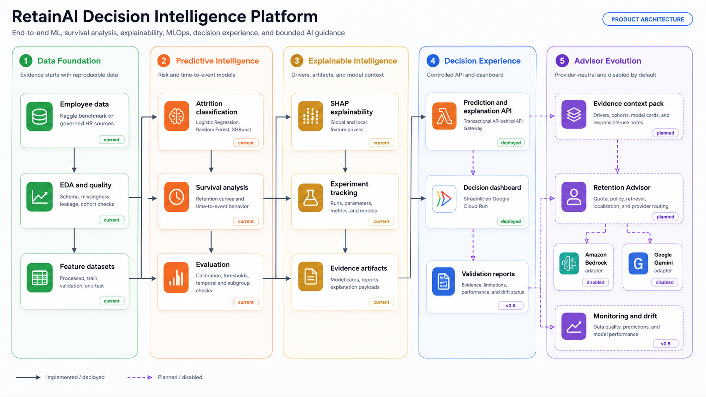
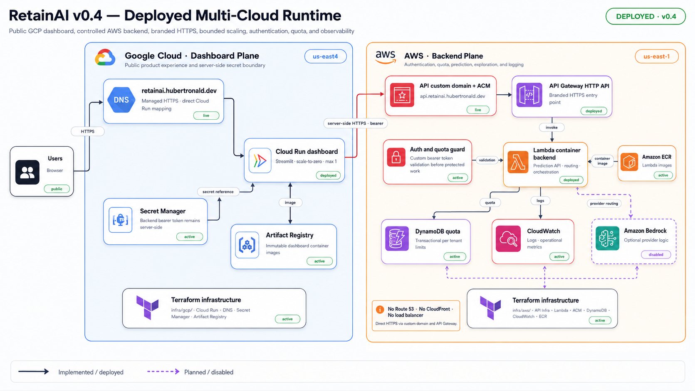

# RetainAI

<p align="left">
  
  
  
  
  
  
  
  
  
  
  
  
  
</p>

### Decision Intelligence Platform for Employee Retention

**RetainAI** is an end-to-end Machine Learning, Explainable AI, MLOps, and
secure multicloud platform for employee-retention analytics.

Rather than providing only employee attrition prediction, RetainAI combines:

- attrition classification;
- survival and time-to-event analysis;
- SHAP-based global and local explainability;
- reproducible experimentation and artifact tracking;
- API-backed prediction services;
- dashboard-driven decision support;
- validation and monitoring foundations;
- provider-neutral AI-assisted retention guidance.

The product is designed as a **Decision Intelligence System for Human
Resources**: analytical evidence remains reviewable, AI providers remain
optional, and high-impact employment decisions remain under human
accountability.

Product design, architecture, and AI-assisted development by
[Hubert Ronald](https://hubertronald.dev/).

## Project vision

RetainAI evolves traditional attrition prediction into an explainable,
multilingual, and provider-neutral retention-intelligence platform.

The long-term direction is to support workforce planning, retention-strategy
design, and responsible HR decision-making without coupling the product to a
single cloud or AI provider.

Amazon Bedrock and Google Gemini are treated as interchangeable advisor
adapters behind a controlled backend. They are not the product itself, and
remain disabled by default until evaluation, quota, privacy, and cost controls
are satisfied.

## Core capabilities

| Capability | Purpose |
|---|---|
| Attrition classification | Estimate employee attrition risk using supervised models |
| Survival analysis | Estimate retention duration and time-to-event behavior |
| Explainable AI | Surface SHAP drivers, feature importance, and evidence |
| Experiment tracking | Preserve reproducible runs, metrics, and artifacts |
| Prediction API | Expose controlled inference and explanation contracts |
| Streamlit dashboard | Present model evidence and decision-support outputs |
| Multicloud delivery | Run the public dashboard on GCP and the backend on AWS |
| Retention Advisor foundation | Route validated evidence to optional Gemini or Bedrock adapters |
| Monitoring roadmap | Add data quality, performance, drift, and validation reports |

<!-- retainai-architecture-visuals:start -->

## Concept architecture

RetainAI is organized as a layered decision-intelligence system. The analytical
foundation already covers data preparation, attrition classification, survival
analysis, SHAP explainability, reproducible experiments, model artifacts, API
services, and dashboard-driven decision support.

The monitoring, retrieval, and advisor layers extend this foundation; they do
not replace it. Solid elements in the diagram represent the implemented or
deployed foundation. Dashed elements represent planned or disabled
capabilities.

[](./figs/retainai_decision_intelligence_architecture.svg)

[Architecture details](./docs/architecture/README.md#decision-intelligence-architecture)

## Current deployed multicloud architecture

The `v0.4` runtime is deployed and operational. Google Cloud hosts the public
product experience, while AWS owns the controlled backend boundary for
authentication, quota, prediction, explainability, and logging.

[](./figs/architecture/retainai_multicloud_runtime_v0_4.svg)

```text
The browser never receives the backend bearer token.
Cloud Run calls the AWS API from server-side Python only.
Lambda owns authentication, quota, logging, and provider routing.
Gemini and Bedrock remain disabled by default.
Application delivery is separate from Terraform infrastructure delivery.
```

[Runtime architecture details](./docs/architecture/README.md#current-deployed-multicloud-runtime)

<!-- retainai-architecture-visuals:end -->

## Live endpoints

| Surface | URL |
|---|---|
| Dashboard | <https://retainai.hubertronald.dev> |
| Backend API | <https://api.retainai.hubertronald.dev> |
| Portfolio | <https://hubertronald.dev> |

## Current release

`v0.4.0` establishes the multicloud product foundation:

- branded dashboard and API domains with managed HTTPS;
- Cloud Run dashboard and Lambda container backend;
- Terraform-managed AWS and GCP infrastructure;
- server-side bearer-token authentication;
- DynamoDB request quotas;
- Cloud Run scale-to-zero with a one-instance maximum;
- AI, RAG, and vector providers disabled by default;
- application delivery separated from infrastructure delivery;
- product documentation organized by architectural domain.

## Documentation

| Area | Guide |
|---|---|
| Documentation index | [docs/README.md](docs/README.md) |
| Architecture | [docs/architecture/README.md](docs/architecture/README.md) |
| Dashboard | [docs/dashboard/README.md](docs/dashboard/README.md) |
| Data | [docs/data/README.md](docs/data/README.md) |
| Exploratory analysis | [docs/eda/README.md](docs/eda/README.md) |
| Modeling | [docs/modeling/README.md](docs/modeling/README.md) |
| MLOps | [docs/mlops/README.md](docs/mlops/README.md) |
| Multicloud delivery | [docs/multicloud/README.md](docs/multicloud/README.md) |
| Prompt engineering | [docs/prompts/README.md](docs/prompts/README.md) |

Additional project files:

- [Changelog](CHANGELOG.md)
- [Contributing](CONTRIBUTING.md)
- [Citation metadata](CITATION.cff)

## Roadmap

- **v0.5 — Monitoring and validation:** data quality, model performance,
  prediction drift, validation reports, and retraining readiness.
- **v0.6 — Internationalization and provider abstraction:** English and Spanish
  locale catalogs, structured localized explanations, Gemini adapter, and
  Bedrock adapter.
- **v0.7 — Talent context and evaluation:** Resume Intelligence, structured
  context, explainability reports, evaluation datasets, and bias checks.
- **v1.0 — Retention Intelligence:** bilingual Retention Advisor, Resume
  Intelligence, monitoring, drift-aware evaluation, auditable explanations,
  and secure automated delivery.

Psychometric Intelligence remains outside the committed `v1.0` scope until
RetainAI has appropriate data, validated instruments, methodological evidence,
privacy and legal review, bias analysis, and qualified interpretation.

## Product credit

Designed and built with ♥ and AI assistance by
[Hubert Ronald](https://hubertronald.dev/).

© 2026 RetainAI — All rights reserved.

## License

Distributed under the MIT License. See [LICENSE](./LICENSE) for more details.
