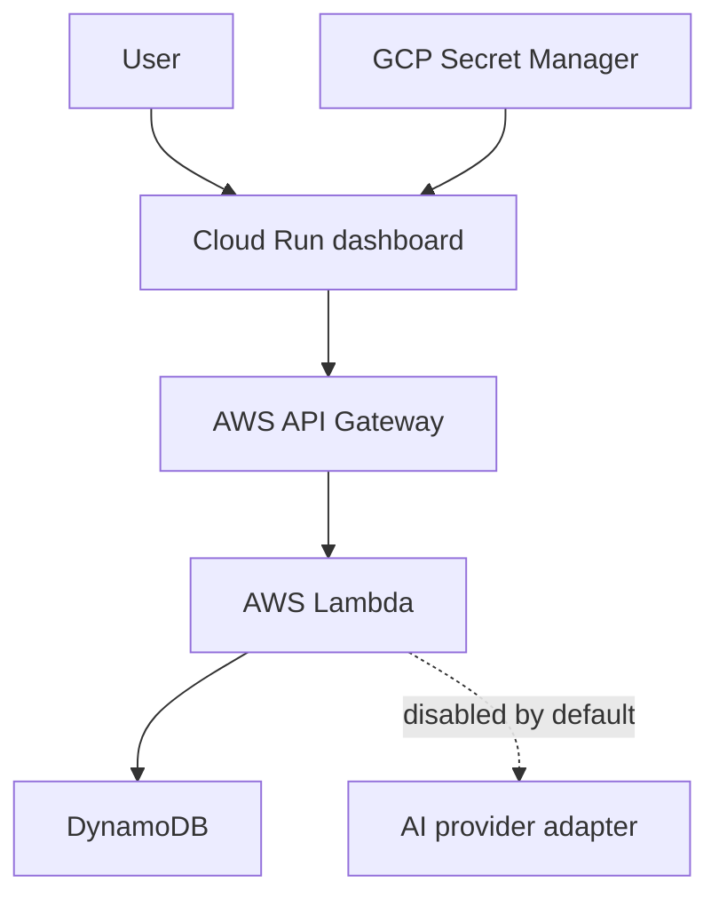

# Architecture

## Table of contents

- [Purpose](#purpose)
- [System context](#system-context)
- [Runtime components](#runtime-components)
- [Request flow](#request-flow)
- [Security boundaries](#security-boundaries)
- [Repository boundaries](#repository-boundaries)
- [Architecture decisions](#architecture-decisions)
- [Related guides](#related-guides)

## Purpose

RetainAI provides explainable retention decision support through a serverless,
multicloud architecture with explicit security and cost boundaries.

## System context



## Runtime components

### Dashboard

```text
framework: Streamlit
runtime: Google Cloud Run
domain: retainai.hubertronald.dev
region: us-east4
```

### Backend

```text
entry: API Gateway HTTP API
compute: AWS Lambda container
domain: api.retainai.hubertronald.dev
region: us-east-1
```

### State and secrets

```text
GCP Secret Manager → dashboard backend token
DynamoDB → quota windows
Artifact Registry → dashboard images
ECR → Lambda images
```

## Request flow

1. The browser loads the Cloud Run dashboard.
2. Server-side dashboard code reads the backend token.
3. The dashboard calls the branded API endpoint.
4. API Gateway invokes Lambda.
5. Lambda validates authentication and quota.
6. AI remains unavailable unless a provider is explicitly enabled.

## Security boundaries

```text
browser never receives backend token
protected routes require authentication
quota enforcement is independent from authentication
AI providers are disabled by default
secrets do not live in source control
```

## Repository boundaries

```text
apps/       application entry points
modules/    reusable domain and security logic
services/   container definitions
infra/      Terraform
scripts/    delivery and operational guards
tests/      automated verification
docs/       conceptual documentation
```

## Architecture decisions

### Terraform only

Pulumi is not part of the active architecture.

### Direct Cloud Run domain mapping

The dashboard uses direct domain mapping for the current product scale.

### Regional API Gateway custom domain

The backend custom domain does not require Route 53, CloudFront, or a load
balancer.

### Application and infrastructure separation

Routine image deployment does not run Terraform.

## Related guides

- [Dashboard](../dashboard/README.md)
- [Multicloud](../multicloud/README.md)
- [MLOps](../mlops/README.md)
- [Documentation index](../README.md)
