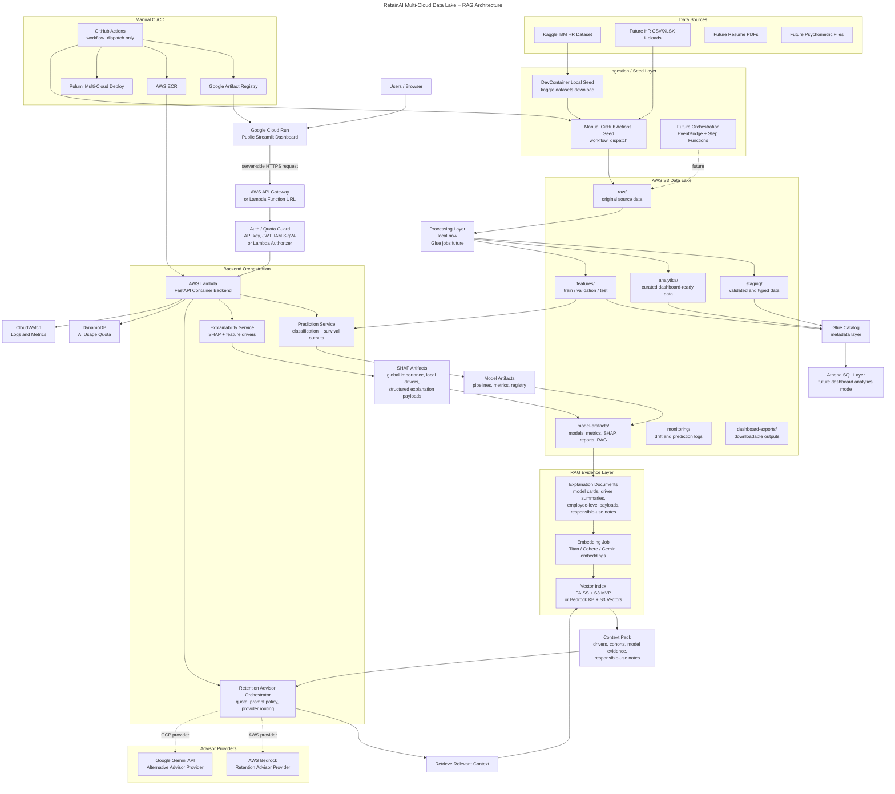

# RetainAI Sprint 7 — Multi-Cloud Data Lake + RAG Deployment Plan

> Version: Sprint 7 planning draft v5  
> Target milestone: `v0.4 — Multi-Cloud Data Lake + RAG Deployment Foundation`  
> Branch: `feature/aws-deployment-foundation`  
> Baseline after Sprint 6: local dashboard + local FastAPI + Docker Compose + MLflow foundation  
> Current prerequisite: multi-cloud DevContainer with AWS CLI, gcloud CLI, Pulumi, Docker and GitHub CLI  
> Final architecture direction: **Google Cloud Run dashboard + AWS Lambda container backend + AWS S3 data lake + AWS-first RAG/vector layer**

---

## 1. Executive Decision

Sprint 7 moves RetainAI from a local product foundation into a **multi-cloud data lake and RAG-ready deployment foundation**.

The previous Sprint 7 RAG plan was directionally correct for the advisor/vector layer, but it underrepresented the data lifecycle that already exists in the RetainAI foundation:

```text
Kaggle / local HR dataset
  ↓
local data zones
  ↓
S3 data lake zones
  ↓
model training and explainability artifacts
  ↓
RAG evidence documents
  ↓
FAISS + S3 vector index
  ↓
AWS Lambda retrieval and advisor orchestration
  ↓
Google Cloud Run dashboard
```

The final Sprint 7 decision is:

```text
Dashboard:
  Google Cloud Run

Backend:
  AWS Lambda with Docker container image

Data lake and artifacts:
  AWS S3 first

Data source strategy:
  Kaggle dataset downloaded locally or through a controlled manual seed workflow
  Dataset is not committed to the repository

Processing strategy:
  local processing remains the current working path
  S3 data lake contracts are introduced in Sprint 7
  Glue / Athena / Step Functions are documented and scaffolded progressively

Vector knowledge layer:
  two-connector strategy:
    1. FAISS + S3 artifact connector for low-cost MVP
    2. Bedrock Knowledge Base + S3 Vectors connector for managed AWS RAG future

AI providers:
  AWS Bedrock and Google Gemini as alternative advisor providers behind the backend

Default AI mode:
  disabled until quota and cost controls are implemented
```

This gives RetainAI a stronger architecture narrative:

```text
RetainAI becomes a multi-cloud HR decision-intelligence platform:
  GCP for public serverless dashboard delivery
  AWS for serverless backend, data lake, model artifacts, orchestration and RAG retrieval
  Bedrock/Gemini as pluggable AI advisor providers
```

---

## 2. Why Multi-Cloud Now

### 2.1 Why Cloud Run for the Dashboard

Cloud Run is the preferred public runtime for the Streamlit dashboard because:

```text
- it runs containers directly;
- it is fully managed;
- it can scale to zero when idle;
- it provides a simple "container in, URL out" experience;
- it avoids keeping an ECS Fargate task running for occasional portfolio traffic;
- it supports a public HTTP dashboard without exposing backend credentials.
```

Sprint 7 should deploy the dashboard as:

```text
Streamlit dashboard
  ↓
Docker image
  ↓
Google Artifact Registry
  ↓
Google Cloud Run
```

### 2.2 Why AWS Lambda Container for the Backend

AWS Lambda container images are the preferred backend runtime because:

```text
- the current FastAPI backend can be adapted with Mangum;
- the backend can be packaged as a Docker image;
- ECR stores the backend image;
- Lambda can scale down when idle;
- AWS-native S3, Bedrock, DynamoDB and CloudWatch integrations stay close to the backend;
- the backend can enforce auth, quota, logging and provider routing before any AI call.
```

Sprint 7 should deploy the backend as:

```text
FastAPI backend
  ↓
Docker image
  ↓
AWS ECR
  ↓
AWS Lambda
  ↓
API Gateway HTTP API or Lambda Function URL
```

### 2.3 Why S3 Data Lake Before RAG

RAG should not float independently from the data and model lifecycle.

The RetainAI RAG layer should be built from:

```text
S3/local model artifacts
S3/local SHAP outputs
S3/local model registry manifests
S3/local reports
responsible-use documents
```

Therefore, Sprint 7 must explicitly preserve the data lake contract:

```text
data/raw                  -> S3 raw/
data/processed            -> S3 analytics/processed/
data/train                -> S3 features/train/
data/validation           -> S3 features/validation/
data/test                 -> S3 features/test/
data/prediction_input     -> S3 raw/prediction-input/ or dashboard-exports/
artifacts/models          -> S3 model-artifacts/models/
artifacts/explanations    -> S3 model-artifacts/explanations/
artifacts/reports         -> S3 model-artifacts/reports/
artifacts/rag             -> S3 model-artifacts/rag/
```

### 2.4 Why Not Kaggle Download Directly From Lambda in Sprint 7

A Lambda-based Kaggle ingestion is possible, but it is not the best Sprint 7 MVP.

Reasons:

```text
- Kaggle credentials would need to be stored in AWS;
- Lambda packaging would need Kaggle client dependencies;
- dataset download and unzip may hit timeout or packaging concerns;
- the dataset is public, static and benchmark-oriented;
- local reproducible download is already part of the project foundation;
- cloud ingestion should be introduced after the S3 data lake contract is stable.
```

Recommended Sprint 7 MVP:

```text
DevContainer or manual GitHub workflow
  ↓
kaggle datasets download
  ↓
local data/raw/ibm_hr_attrition/
  ↓
manual or scripted sync to S3 raw/
```

Future industrialized path:

```text
EventBridge schedule or manual workflow
  ↓
Step Functions
  ↓
Kaggle seed Lambda or controlled ingestion task
  ↓
S3 raw/
  ↓
validation Lambda
  ↓
Glue job raw -> staging -> analytics -> features
  ↓
Glue Catalog / Athena
  ↓
training / model artifacts / RAG evidence documents
```

---

## 3. Revised Multi-Cloud Data Lake + RAG Target Architecture



---

## 4. Text Architecture

```text
Users
  ↓
Cloud Run public dashboard
  ↓ server-side request only
AWS API Gateway or Lambda Function URL
  ↓ auth/quota guard
AWS Lambda FastAPI container backend
  ↓
Backend orchestration
  ├── Prediction Service
  ├── Explainability Service
  └── Retention Advisor Orchestrator

Data lifecycle
  ├── Kaggle / future HR files
  ├── local seed or manual GitHub seed
  ├── S3 raw/
  ├── S3 staging/
  ├── S3 analytics/
  ├── S3 features/
  ├── S3 model-artifacts/
  ├── S3 monitoring/
  └── S3 dashboard-exports/

Processing and metadata
  ├── local preprocessing now
  ├── Glue Catalog foundation
  ├── Athena external table foundation
  ├── future Glue jobs
  └── future Step Functions orchestration

RAG / vector knowledge layer
  ├── explanation documents
  ├── SHAP driver summaries
  ├── model cards
  ├── employee-level payloads
  ├── responsible-use notes
  └── vector index
        ├── FAISS + S3 MVP connector
        └── Bedrock Knowledge Base + S3 Vectors managed connector
        ↓
        retrieved context
        ↓
  Provider routing
  ├── AWS Bedrock provider
  └── Google Gemini provider
```

Important architectural boundary:

```text
Cloud Run does not call Bedrock or Gemini directly.
The browser never receives AI provider keys.
Gemini does not call Bedrock.
Bedrock does not call Gemini.
AWS Lambda owns retrieval, quota, prompt policy, logging and provider routing.
```

---

## 5. Data Lake Strategy

### 5.1 Public Dataset Source

Initial dataset:

```text
IBM HR Analytics Employee Attrition & Performance
Source: Kaggle
Dataset slug: pavansubhasht/ibm-hr-analytics-attrition-dataset
Expected file: WA_Fn-UseC_-HR-Employee-Attrition.csv
```

The dataset must not be committed to the repository.

Local users should download the dataset directly from Kaggle and comply with the dataset terms.

Expected local layout:

```text
data/
└── raw/
    └── ibm_hr_attrition/
        └── WA_Fn-UseC_-HR-Employee-Attrition.csv
```

Recommended local command:

```bash
mkdir -p data/raw/ibm_hr_attrition

kaggle datasets download \
  -d pavansubhasht/ibm-hr-analytics-attrition-dataset \
  -p data/raw/ibm_hr_attrition \
  --unzip
```

Credential requirement:

```text
~/.kaggle/kaggle.json
```

Do not commit:

```text
data/raw/ibm_hr_attrition/*.csv
~/.kaggle/kaggle.json
Kaggle API tokens
```

### 5.2 Local Data Zones

Current local project layout:

```text
data/
├── raw/
├── processed/
├── train/
├── validation/
├── test/
└── prediction_input/
```

Local responsibilities:

```text
raw:
  original Kaggle data, unchanged

processed:
  cleaned and typed dataset

train:
  training split

validation:
  model selection and dashboard validation

test:
  final holdout and demo scoring

prediction_input:
  files uploaded through dashboard or CLI
```

### 5.3 S3 Data Lake Zones

Recommended S3 layout:

```text
s3://retainai-<env>-data/
  raw/
  staging/
  analytics/
  features/
  model-artifacts/
  monitoring/
  dashboard-exports/
```

Environment examples:

```text
s3://retainai-dev-data/
s3://retainai-prod-data/
```

Zone responsibilities:

```text
raw:
  original source data, unchanged

staging:
  validated, typed and lightly standardized data

analytics:
  curated dashboard-ready datasets

features:
  train / validation / test splits and feature matrices

model-artifacts:
  models, metrics, MLflow exports, SHAP, reports, model registry, RAG documents and vector indexes

monitoring:
  feature drift, prediction drift, scoring logs and retraining signals

dashboard-exports:
  user-facing downloadable predictions, summaries and reports
```

### 5.4 Local to S3 Mapping

| Local path | S3 path |
|---|---|
| `data/raw/` | `s3://retainai-<env>-data/raw/` |
| `data/processed/` | `s3://retainai-<env>-data/analytics/processed/` |
| `data/train/` | `s3://retainai-<env>-data/features/train/` |
| `data/validation/` | `s3://retainai-<env>-data/features/validation/` |
| `data/test/` | `s3://retainai-<env>-data/features/test/` |
| `data/prediction_input/` | `s3://retainai-<env>-data/raw/prediction-input/` |
| `artifacts/models/` | `s3://retainai-<env>-data/model-artifacts/models/` |
| `artifacts/explanations/` | `s3://retainai-<env>-data/model-artifacts/explanations/` |
| `artifacts/reports/` | `s3://retainai-<env>-data/model-artifacts/reports/` |
| `artifacts/figures/` | `s3://retainai-<env>-data/model-artifacts/figures/` |
| `artifacts/dashboard/` | `s3://retainai-<env>-data/dashboard-exports/` |
| `artifacts/rag/` | `s3://retainai-<env>-data/model-artifacts/rag/` |

### 5.5 Sprint 7 S3 Seed Strategy

Sprint 7 should support a manual seed path before fully automated cloud ingestion.

MVP:

```text
1. Download Kaggle dataset locally in DevContainer or host.
2. Generate local processed/train/validation/test outputs.
3. Sync selected data/artifacts to S3.
4. Use S3 paths as stable cloud contracts.
```

Example future seed command:

```bash
aws s3 sync data/raw/ \
  s3://retainai-dev-data/raw/ \
  --delete

aws s3 sync data/processed/ \
  s3://retainai-dev-data/analytics/processed/ \
  --delete

aws s3 sync data/train/ \
  s3://retainai-dev-data/features/train/ \
  --delete

aws s3 sync data/validation/ \
  s3://retainai-dev-data/features/validation/ \
  --delete

aws s3 sync data/test/ \
  s3://retainai-dev-data/features/test/ \
  --delete

aws s3 sync artifacts/ \
  s3://retainai-dev-data/model-artifacts/ \
  --exclude "mlflow/**"
```

Do not run these commands until AWS credentials and the target S3 bucket exist.

### 5.6 Future Data Lake Orchestration

Sprint 7 should document this path, but not fully implement it:

```text
Manual trigger or EventBridge schedule
  ↓
Step Functions state machine
  ↓
Ingestion step
  ├── Kaggle seed Lambda / container task
  └── future HR file arrival from S3 upload
  ↓
Validation Lambda
  ↓
Glue Job: raw -> staging
  ↓
Glue Job: staging -> analytics/features
  ↓
Glue Crawler / Catalog update
  ↓
Athena tables
  ↓
Training / scoring / dashboard / RAG evidence generation
```

When to choose Step Functions:

```text
- multiple steps;
- retries and error handling matter;
- Glue jobs and Lambdas need sequencing;
- observability of the data pipeline is important.
```

When to choose Glue Workflow:

```text
- the pipeline is mostly Glue jobs and crawlers;
- less custom orchestration is needed;
- AWS Glue is the operational center of the data lake.
```

Sprint 7 decision:

```text
Document Step Functions as the preferred future orchestration story.
Document Glue Workflow as an AWS-native alternative for Glue-heavy ETL.
Do not implement full cloud ETL in Sprint 7.
```

---

## 6. AWS Component Responsibilities

| Component | Sprint 7 Responsibility |
|---|---|
| S3 | Data lake zones, model artifacts, RAG documents, vector indexes, dashboard exports and monitoring outputs. |
| ECR | Store backend Lambda container image only. |
| Google Artifact Registry | Store Cloud Run dashboard container image. |
| Lambda | FastAPI backend, inference endpoints, RAG retrieval/advisor orchestration, quota checks, future ingestion/validation triggers. |
| API Gateway / Lambda Function URL | Controlled backend entrypoint for Cloud Run server-side calls. |
| IAM | Least-privilege roles for Lambda, GitHub Actions, Pulumi and S3 access. |
| DynamoDB | Usage quota table for AI/Bedrock/Gemini endpoints, keyed by IP/user/session. |
| CloudWatch | Logs, metrics and operational visibility for AWS backend and future data jobs. |
| Glue Catalog | Metadata layer for S3 raw/staging/analytics/features zones. |
| Glue Jobs | Future raw -> staging -> analytics/features ETL. Not full Sprint 7 implementation. |
| Athena | Future SQL layer for S3-backed dashboard and validation queries. |
| EventBridge | Future scheduled validation, seed and retraining workflows. |
| Step Functions | Future orchestration across ingestion, validation, Glue, training and RAG document generation. |
| Bedrock | Future Retention Advisor provider and managed RAG connector. Disabled by default. |
| Gemini | Alternative advisor provider behind the AWS backend. Disabled by default. |
| Route 53 + ACM | Future custom domain and HTTPS certificate. |
| WAF | Future coarse public traffic protection and abuse control. |

---

## 7. Vector Store Decision

Sprint 7 should implement a **two-connector design**:

```text
1. FAISS + S3 connector
   Purpose:
     low-cost MVP, fully controlled, easy to demo

2. Bedrock Knowledge Base connector
   Purpose:
     managed AWS RAG path, likely with S3 Vectors as preferred vector store
```

Recommended config:

```yaml
rag:
  enabled: false
  vector_store: disabled
  embedding_provider: disabled
  advisor_provider: disabled

  local:
    documents_path: artifacts/rag/documents/
    manifest_path: artifacts/rag/manifest.json

  faiss_s3:
    bucket: retainai-dev-data
    prefix: model-artifacts/rag/vector-index/faiss/

  bedrock_knowledge_base:
    knowledge_base_id: null
    retrieval_top_k: 5
```

Supported future values:

```text
RAG_VECTOR_STORE=disabled
RAG_VECTOR_STORE=faiss_s3
RAG_VECTOR_STORE=bedrock_kb

RETAINAI_EMBEDDING_PROVIDER=disabled
RETAINAI_EMBEDDING_PROVIDER=bedrock_titan
RETAINAI_EMBEDDING_PROVIDER=gemini

RETAINAI_AI_PROVIDER=disabled
RETAINAI_AI_PROVIDER=bedrock
RETAINAI_AI_PROVIDER=gemini
```

Default:

```text
RAG_VECTOR_STORE=disabled
RETAINAI_EMBEDDING_PROVIDER=disabled
RETAINAI_AI_PROVIDER=disabled
```

---

## 8. What Gets Vectorized

Do **not** vectorize raw SHAP objects directly.

Instead, generate explanation documents from SHAP outputs, reports and model artifacts.

Inputs:

```text
artifacts/explanations/<model>/feature_importance.parquet
artifacts/explanations/<model>/metadata.json
artifacts/explanations/samples/*.json
artifacts/reports/explainability_report_<model>.md
artifacts/reports/classification_report.md
artifacts/reports/survival_report.md
artifacts/models/model_registry.json
```

Generated local documents:

```text
artifacts/rag/documents/
  model_card_logistic_regression.md
  model_card_random_forest.md
  global_drivers_xgboost.md
  survival_retention_summary.md
  local_explanation_sample_001.md
  responsible_use_policy.md
```

Generated S3 documents:

```text
s3://retainai-<env>-data/model-artifacts/rag/documents/
  model_card_logistic_regression.md
  model_card_random_forest.md
  global_drivers_xgboost.md
  survival_retention_summary.md
  local_explanation_sample_001.md
  responsible_use_policy.md
```

Example document metadata:

```json
{
  "document_type": "local_explanation",
  "model_name": "random_forest",
  "risk_level": "high",
  "employee_segment": "Sales / OverTime Yes",
  "top_drivers": ["OverTime", "MonthlyIncome", "StockOptionLevel"],
  "source_artifact": "artifacts/explanations/samples/sample_001.json",
  "s3_target_prefix": "s3://retainai-dev-data/model-artifacts/rag/documents/"
}
```

---

## 9. RAG Retrieval Flow

```text
User asks for retention advice in dashboard
  ↓
Cloud Run sends server-side request to AWS backend
  ↓
API Gateway / Lambda auth validates request
  ↓
Lambda checks DynamoDB quota
  ↓
Lambda builds retrieval query from employee/profile/model context
  ↓
Vector connector retrieves relevant evidence
  ↓
Retention Advisor Orchestrator builds context pack
  ↓
Provider router chooses disabled / Bedrock / Gemini
  ↓
LLM generates response only if enabled and allowed
  ↓
Lambda logs metadata and returns response to dashboard
```

Important:

```text
No AI response should be generated before quota validation.
No provider key should exist in browser-side code.
No raw sensitive employee data should be sent to external providers without redaction.
```

---

## 10. Security and Cost Control

Requirement:

```text
Limit AI model usage to 3 queries per user/IP.
```

Recommended design:

```text
Layer 1 — Cloud Run dashboard:
  no direct AI calls from browser.

Layer 2 — AWS API Gateway / Lambda Authorizer:
  validate dashboard token or signed request.

Layer 3 — DynamoDB usage quota:
  exact 3 AI requests per IP/user/session/window.

Layer 4 — Provider disabled by default:
  Bedrock/Gemini disabled until quota is tested.

Layer 5 — CloudWatch / GCP logs:
  monitor usage and failures.
```

DynamoDB table:

```text
retainai-ai-usage-quota

Partition key:
  quota_key = hash(ip + provider + endpoint_group)

Attributes:
  request_count
  quota_limit
  window_start
  expires_at TTL
```

MVP quota:

```text
3 requests per IP per 24-hour window for AI-backed endpoints.
```

---

## 11. Deployment Strategy

### 11.1 Dashboard — Google Cloud Run

```text
Streamlit dashboard
  ↓
Docker image
  ↓
Google Artifact Registry
  ↓
Cloud Run public service
```

Recommended dashboard environment variables:

```text
RETAINAI_DASHBOARD_MODE=api
RETAINAI_API_PROVIDER=aws-lambda
RETAINAI_API_URL=<aws-api-gateway-or-lambda-url>
RETAINAI_AI_PROVIDER=disabled
```

Cloud Run calls the backend from server-side Python code only.

### 11.2 Backend — AWS Lambda Container

```text
FastAPI backend
  ↓
Docker image
  ↓
AWS ECR
  ↓
AWS Lambda
  ↓
API Gateway or Lambda Function URL
```

Backend packaging additions:

```text
apps/api/lambda_handler.py
services/api-lambda/Dockerfile
```

Expected FastAPI Lambda adapter:

```python
from mangum import Mangum
from apps.api.main import app

handler = Mangum(app)
```

### 11.3 Data Lake — AWS S3 Foundation

Sprint 7 Pulumi should create:

```text
s3://retainai-dev-data/
  raw/
  staging/
  analytics/
  features/
  model-artifacts/
  monitoring/
  dashboard-exports/
```

Sprint 7 should not require full Glue ETL to close.

Minimum deliverable:

```text
S3 bucket
bucket policy / encryption / block public access
zone prefixes documented
local-to-S3 mapping documented
manual seed path documented
```

---

## 12. Multi-Cloud IaC Strategy

Primary IaC:

```text
Pulumi Python
```

Recommended directory:

```text
infra/multicloud-pulumi-python/
```

Suggested structure:

```text
infra/multicloud-pulumi-python/
├── Pulumi.yaml
├── Pulumi.dev.yaml
├── Pulumi.prod.yaml
├── __main__.py
├── requirements.txt
├── README.md
└── retainai_infra/
    ├── __init__.py
    ├── config.py
    ├── aws_storage.py
    ├── aws_data_lake.py
    ├── aws_ecr.py
    ├── aws_lambda_api.py
    ├── aws_api_gateway.py
    ├── aws_quota.py
    ├── aws_rag.py
    ├── aws_glue_catalog.py
    ├── aws_orchestration.py
    ├── gcp_artifact_registry.py
    ├── gcp_cloud_run.py
    ├── gcp_secrets.py
    └── outputs.py
```

Sprint 7 Pulumi should scaffold:

```text
AWS:
  S3 data lake bucket
  S3 zone prefixes / bucket outputs
  ECR backend repository
  Lambda execution role
  DynamoDB quota table
  CloudWatch log group
  optional API Gateway skeleton
  optional Glue database/catalog skeleton

GCP:
  Artifact Registry repository
  Cloud Run service skeleton
  Secret Manager placeholders
```

---

## 13. GitHub Actions Strategy

Requirement:

```text
No automatic execution on PR.
No automatic execution on push.
No automatic run on docs-only changes.
Only ad hoc/manual execution from main.
```

Recommended workflow:

```text
.github/workflows/multicloud-release.yml
```

Trigger:

```yaml
on:
  workflow_dispatch:
```

Inputs:

```text
action: preview | release | seed-data
environment: dev | prod
deploy_to_cloud: false | true
build_dashboard: true | false
build_backend: true | false
seed_data_lake: false | true
build_rag_index: false | true
```

Hard guard:

```yaml
if: github.ref_name == 'main'
```

---

## 14. Credentials Strategy

### 14.1 Local DevContainer

The DevContainer should support:

```text
AWS CLI
gcloud CLI
Pulumi CLI
Docker CLI
GitHub CLI
Python 3.10
```

Local auth:

```bash
# AWS
aws sso login --profile retainai-dev
export AWS_PROFILE=retainai-dev
export AWS_REGION=us-east-1

# GCP
gcloud auth login
gcloud auth application-default login
gcloud config set project <gcp-project-id>
gcloud config set run/region us-central1

# Pulumi
pulumi login
pulumi stack select dev
pulumi preview
```

Do not commit:

```text
AWS keys
GCP service account JSON files
Kaggle API tokens
.env files with credentials
API keys
Gemini keys
Bedrock credentials
```

---

## 15. Sprint 7 Work Breakdown

### Sprint 7.0 — Multi-Cloud Data Lake + RAG Planning Update

Deliverables:

```text
docs/multicloud/sprint7_multicloud_deployment_plan.md
docs/multicloud/vector_store_strategy.md
docs/multicloud/security_and_cost_controls.md
docs/multicloud/credential_strategy.md
docs/multicloud/deployment_decisions.md
docs/multicloud/s3_data_lake_strategy.md
docs/multicloud/kaggle_data_source.md
docs/multicloud/data_lake_orchestration.md
```

Acceptance criteria:

```text
[ ] Cloud Run selected for public dashboard.
[ ] AWS Lambda container selected for backend.
[ ] App Runner removed as Sprint 7 deployment target.
[ ] ECS Fargate moved to future/fallback only.
[ ] AWS S3 data lake zones are restored in the architecture.
[ ] Kaggle source and local seed path are documented.
[ ] Local-to-S3 data/artifact mapping is documented.
[ ] FAISS + S3 selected as low-cost MVP vector connector.
[ ] Bedrock KB + S3 Vectors selected as managed future connector.
[ ] Aurora/OpenSearch documented as future options only.
[ ] Manual GitHub Actions strategy accepted.
```

### Sprint 7.1 — Data Lake Contract and S3 Seed Foundation

Deliverables:

```text
docs/multicloud/s3_data_lake_strategy.md
docs/multicloud/kaggle_data_source.md
docs/multicloud/data_lake_orchestration.md
modules/data_lake/__init__.py
modules/data_lake/zone_mapping.py
modules/data_lake/manifest.py
configs/aws.yaml
configs/data.yaml
```

Acceptance criteria:

```text
[ ] Kaggle dataset source is documented.
[ ] Dataset is not committed to the repository.
[ ] Local data zones are mapped to S3 data lake zones.
[ ] S3 raw/staging/analytics/features/model-artifacts/monitoring paths are documented.
[ ] Manual local-to-S3 seed path is documented.
[ ] Future Step Functions + Glue orchestration path is documented.
[ ] No AWS/GCP commands are required unless explicitly running cloud seed or Pulumi.
```

### Sprint 7.2 — RAG Document Generation Foundation

Deliverables:

```text
modules/rag/__init__.py
modules/rag/document_builder.py
modules/rag/schemas.py
modules/rag/manifest.py
configs/rag.yaml
docs/multicloud/vector_store_strategy.md
```

Acceptance criteria:

```text
[ ] SHAP/model artifacts can be converted into explanation documents.
[ ] Generated documents have metadata.
[ ] Responsible-use document exists.
[ ] Local output path is documented.
[ ] S3 model-artifacts/rag/documents path is documented.
```

### Sprint 7.3 — FAISS + S3 Connector Foundation

Deliverables:

```text
modules/rag/vector_store.py
modules/rag/faiss_store.py
modules/rag/build_faiss_index.py
docs/multicloud/faiss_s3_vector_store.md
```

Acceptance criteria:

```text
[ ] FAISS connector interface exists.
[ ] Index build command is documented.
[ ] Index manifest is generated.
[ ] S3 upload path is documented.
[ ] Backend can retrieve top-k context locally.
```

### Sprint 7.4 — Cloud Run Dashboard Container

Deliverables:

```text
services/dashboard/Dockerfile review
docs/multicloud/cloud_run_dashboard.md
infra/gcp-terraform/versions.tf
infra/gcp-terraform/providers.tf
infra/gcp-terraform/variables.tf
infra/gcp-terraform/main.tf
infra/gcp-terraform/outputs.tf
infra/gcp-terraform/terraform.tfvars.example
```

Acceptance criteria:

```text
[ ] Dashboard image builds locally.
[ ] Image can be pushed to Artifact Registry.
[ ] Cloud Run service can be previewed by Pulumi.
[ ] Runtime env vars are defined.
[ ] Secrets are not baked into image.
```

### Sprint 7.5 — AWS Lambda Backend Container

Deliverables:

```text
apps/api/lambda_handler.py
services/api-lambda/Dockerfile
docs/multicloud/aws_lambda_backend.md
infra/aws-terraform/versions.tf
infra/aws-terraform/providers.tf
infra/aws-terraform/variables.tf
infra/aws-terraform/main.tf
infra/aws-terraform/outputs.tf
infra/aws-terraform/terraform.tfvars.example
```

Acceptance criteria:

```text
[ ] FastAPI app has Mangum handler.
[ ] Lambda container image builds locally.
[ ] Image can be pushed to ECR.
[ ] Lambda can answer /health.
[ ] Backend endpoint requires auth or protected token.
```

### Sprint 7.6 — Cross-Cloud Auth and Quota

Deliverables:

```text
modules/security/usage_quota.py
apps/api/middleware or router guard
docs/multicloud/security_and_cost_controls.md
infra/aws-terraform/quota.tf
infra/gcp-terraform/secrets.tf
```

Acceptance criteria:

```text
[ ] Cloud Run stores backend token/signing material in Secret Manager.
[ ] AWS backend validates token/signature.
[ ] DynamoDB quota table exists.
[ ] AI endpoints are disabled by default.
[ ] 3-query-per-IP logic is documented.
```

### Sprint 7.7 — Manual Multi-Cloud GitHub Actions

Deliverables:

```text
.github/workflows/multicloud-release.yml
docs/multicloud/github_actions_deployment.md
```

Acceptance criteria:

```text
[ ] workflow_dispatch only.
[ ] main branch guard.
[ ] preview action works.
[ ] release requires deploy_to_cloud=true.
[ ] no PR or push trigger.
[ ] separate build flags for dashboard, backend, data seed and RAG index.
```

---

## 16. Proposed Repository Additions

```text
docs/multicloud/
├── sprint7_multicloud_deployment_plan.md
├── vector_store_strategy.md
├── security_and_cost_controls.md
├── credential_strategy.md
├── deployment_decisions.md
├── s3_data_lake_strategy.md
├── kaggle_data_source.md
├── data_lake_orchestration.md
├── cloud_run_dashboard.md
├── aws_lambda_backend.md
├── github_actions_deployment.md
└── faiss_s3_vector_store.md

modules/data_lake/
├── __init__.py
├── zone_mapping.py
└── manifest.py

modules/rag/
├── __init__.py
├── schemas.py
├── document_builder.py
├── manifest.py
├── vector_store.py
├── faiss_store.py
├── bedrock_kb_store.py
└── build_faiss_index.py

configs/
└── rag.yaml
```

---

## 17. Deferred / Not in Sprint 7

Do not implement yet:

```text
AWS App Runner deployment target.
ECS/Fargate service deployment.
Kubernetes / Anthos.
Full Kaggle cloud ingestion automation.
Full Step Functions production orchestration.
Full Glue ETL jobs.
Full Athena semantic model.
Full Bedrock production integration.
Full Gemini production integration.
Production Aurora pgvector.
Production OpenSearch Serverless.
Public unauthenticated AI endpoint.
Complex user authentication system.
Custom domain as a blocker.
```

Clarifications:

```text
AWS App Runner:
  Not selected as the Sprint 7 deployment target because RetainAI is moving
  toward Cloud Run for the public dashboard and AWS Lambda container images
  for the backend.

ECS/Fargate:
  Not required for Lambda Docker.
  Fargate would be a separate container service architecture involving ECS
  services, tasks, target groups and load balancers. Sprint 7 does not need it.

Lambda Docker:
  Remains in scope.
  The backend will be packaged as a Docker image, pushed to ECR, and deployed
  as an AWS Lambda container image.

Cloud ETL:
  Glue and Step Functions are part of the target architecture.
  Sprint 7 documents and optionally scaffolds them, but does not need to run
  full production ETL to close.
```

---

## 18. Risk Register

| Risk | Mitigation |
|---|---|
| Data lake scope grows too much | Sprint 7 defines contracts and seed path first; full ETL orchestration is future. |
| Kaggle credentials leak | Keep Kaggle token local; do not commit credentials; avoid GitHub/Kaggle automation until needed. |
| Dataset redistribution issue | Do not commit Kaggle CSV; document reproducible download instructions. |
| Cross-cloud auth complexity | Start with API Gateway + Lambda Authorizer or signed token; document IAM SigV4 as future hardening. |
| Secret leakage | Store secrets in GCP Secret Manager or AWS Secrets Manager; never in browser or repo. |
| Public backend abuse | Backend requires auth and quota before AI endpoints. |
| AI cost spike | Bedrock/Gemini disabled by default; DynamoDB quota before enabling. |
| FAISS index too large for Lambda | Keep MVP corpus small; store index in S3; lazy-load; move to Bedrock KB/S3 Vectors when needed. |
| FAISS native dependency issues | Package `faiss-cpu` inside Lambda container image, not ZIP/layer. |
| RAG evidence quality | Build explanation documents from model outputs, not raw SHAP arrays. |
| Cloud Run cold start | Keep dashboard image lean; min instances 0 for cost, 1 only for demos. |
| Lambda cold start | Keep backend image small; lazy-load model/vector artifacts. |
| Multi-cloud CI complexity | Manual workflow only; deploy flags; main branch guard. |
| Data egress | Dashboard calls backend for data; avoid frequent large cross-cloud transfers. |
| Glue/Athena cost creep | Do not run crawlers/jobs continuously; keep manual execution or small scoped previews. |

---

## 19. Sprint 7 Closeout Criteria

Sprint 7 closes when:

```text
[ ] Multi-cloud data lake + RAG deployment plan is documented.
[ ] Cloud Run dashboard path is defined.
[ ] AWS Lambda container backend path is defined.
[ ] AWS S3 data lake zone contract is documented.
[ ] Kaggle local seed path is documented.
[ ] Local-to-S3 mapping for data and artifacts is documented.
[ ] Future Step Functions + Glue orchestration path is documented.
[ ] Cross-cloud auth strategy is selected.
[ ] FAISS + S3 vector connector strategy is documented.
[ ] Bedrock KB managed connector strategy is documented.
[ ] S3/ECR/GAR/DynamoDB foundation is documented or scaffolded.
[ ] Manual GitHub Actions workflow exists and only runs from main.
[ ] Credentials strategy covers AWS, GCP and local data-source credentials.
[ ] Security/cost controls for AI endpoints are documented.
[ ] README references multi-cloud data lake + RAG deployment roadmap.
```

---

## 20. Suggested Sprint 7 Commit Plan

### Commit 1 — Multi-cloud data lake and RAG planning docs

```bash
git add docs/multicloud/

git commit -m "Align Sprint 7 plan with data lake and RAG lifecycle"
```

### Commit 2 — Data lake contract skeleton

```bash
git add \
  modules/data_lake/__init__.py \
  modules/data_lake/zone_mapping.py \
  modules/data_lake/manifest.py \
  docs/multicloud/s3_data_lake_strategy.md \
  docs/multicloud/kaggle_data_source.md \
  docs/multicloud/data_lake_orchestration.md \
  configs/aws.yaml \
  configs/data.yaml

git commit -m "Add data lake contract and seed foundation"
```

### Commit 3 — RAG document generation skeleton

```bash
git add \
  modules/rag/__init__.py \
  modules/rag/schemas.py \
  modules/rag/document_builder.py \
  modules/rag/manifest.py \
  configs/rag.yaml \
  docs/multicloud/vector_store_strategy.md

git commit -m "Add RAG evidence document generation foundation"
```

### Commit 4 — FAISS S3 vector connector skeleton

```bash
git add \
  modules/rag/vector_store.py \
  modules/rag/faiss_store.py \
  modules/rag/build_faiss_index.py \
  docs/multicloud/faiss_s3_vector_store.md

git commit -m "Add FAISS S3 vector store foundation"
```

### Commit 5 — Pulumi multi-cloud skeleton

```bash
git add infra/multicloud-pulumi-python/

git commit -m "Add Pulumi multi-cloud foundation skeleton"
```

---

## 21. Recommended Final Decision Set

```text
Dashboard:
  Google Cloud Run

Backend:
  AWS Lambda container image

Backend access:
  API Gateway HTTP API + Lambda Authorizer for MVP
  or Lambda Function URL + AWS_IAM as advanced hardening

Data source:
  Kaggle IBM HR dataset local/manual seed first
  no dataset committed to repository

Data lake:
  AWS S3 raw / staging / analytics / features / model-artifacts / monitoring / dashboard-exports

Processing:
  local processing now
  Glue jobs and Step Functions future
  Glue Catalog / Athena metadata and SQL layer as foundation/future mode

Vector store MVP:
  FAISS + S3 serialized index

Managed vector store future:
  Bedrock Knowledge Base + S3 Vectors first
  OpenSearch Serverless or Aurora pgvector only if justified

Backend image registry:
  AWS ECR

Dashboard image registry:
  Google Artifact Registry

IaC:
  Pulumi Python multi-provider project

CI/CD:
  Manual GitHub Actions from main only

Credentials:
  AWS OIDC + GCP Workload Identity Federation in GitHub
  AWS SSO + gcloud auth locally
  Kaggle token local only unless a controlled manual seed workflow is added

AI:
  Bedrock and Gemini disabled by default
  enable only after quota guard is implemented
```

---

## 22. References

- AWS Lambda container images: https://docs.aws.amazon.com/lambda/latest/dg/images-create.html
- Google Cloud Run autoscaling: https://docs.cloud.google.com/run/docs/about-instance-autoscaling
- FAISS documentation: https://faiss.ai/
- Amazon S3 Vectors: https://docs.aws.amazon.com/AmazonS3/latest/userguide/s3-vectors.html
- S3 Vectors with Bedrock Knowledge Bases: https://docs.aws.amazon.com/AmazonS3/latest/userguide/s3-vectors-bedrock-kb.html
- Bedrock Knowledge Bases vector stores: https://docs.aws.amazon.com/bedrock/latest/userguide/knowledge-base-setup.html
- AWS Glue: https://docs.aws.amazon.com/glue/
- AWS Step Functions: https://docs.aws.amazon.com/step-functions/
- Amazon Athena: https://docs.aws.amazon.com/athena/
- Gemini embeddings: https://ai.google.dev/gemini-api/docs/embeddings
