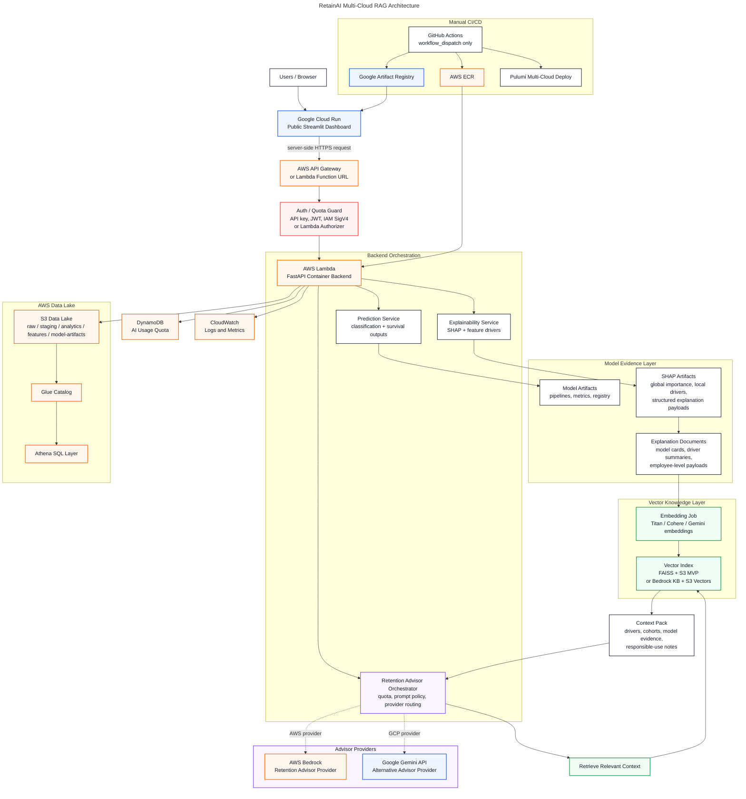

# RetainAI Sprint 7 — Multi-Cloud RAG Deployment Plan

> Target milestone: `v0.4 — Multi-Cloud RAG Deployment Foundation`  
> Dashboard: Google Cloud Run  
> Backend: AWS Lambda container image  
> Data/artifacts: AWS S3  
> Vector MVP: FAISS + S3  
> Managed RAG future: Bedrock Knowledge Base + S3 Vectors  
> Default AI mode: disabled

---

## 1. Executive Decision

Sprint 7 starts the transition from local RetainAI product foundation into a multi-cloud deployment foundation.

Final target direction:

```text
Dashboard:
  Google Cloud Run

Backend:
  AWS Lambda with Docker container image

Data and artifacts:
  AWS S3

Vector knowledge layer:
  FAISS + S3 for the low-cost MVP
  Bedrock Knowledge Base + S3 Vectors as the managed AWS future path

AI providers:
  AWS Bedrock and Google Gemini behind the backend provider router

IaC:
  Pulumi Python multi-provider project

CI/CD:
  Manual GitHub Actions from main only
```

---

## 2. Architecture



---

## 3. Text Architecture

```text
Users
  ↓
Cloud Run public dashboard
  ↓ server-side request only
AWS API Gateway or Lambda Function URL
  ↓ auth/quota guard
AWS Lambda FastAPI container backend
  ↓
Backend orchestration
  ├── Prediction Service
  ├── Explainability Service
  └── Retention Advisor Orchestrator
        ↓
        RAG / Vector Knowledge Layer
        ├── explanation documents
        ├── SHAP driver summaries
        ├── model cards
        ├── employee-level payloads
        └── vector index
              ├── FAISS + S3 MVP connector
              └── Bedrock Knowledge Base managed connector
              ↓
              retrieved context
              ↓
        Provider routing
        ├── AWS Bedrock provider
        └── Google Gemini provider
```

Important boundary:

```text
Cloud Run does not call Bedrock or Gemini directly.
The browser never receives AI provider keys.
Gemini does not call Bedrock.
Bedrock does not call Gemini.
AWS Lambda owns retrieval, quota, prompt policy, logging and provider routing.
```

---

## 4. Sprint 7.0 Acceptance Criteria

```text
[ ] Cloud Run selected for public dashboard.
[ ] AWS Lambda container selected for backend.
[ ] App Runner removed as deployment target.
[ ] ECS/Fargate moved to future/fallback only.
[ ] FAISS + S3 selected as low-cost MVP vector connector.
[ ] Bedrock KB + S3 Vectors selected as managed future connector.
[ ] Aurora/OpenSearch documented as future options only.
[ ] Manual GitHub Actions strategy accepted.
```

---

## 5. Deferred / Not in Sprint 7

Do not implement yet:

```text
AWS App Runner deployment target.
ECS/Fargate service deployment.
Kubernetes / Anthos.
Full Bedrock production integration.
Full Gemini production integration.
Production Aurora pgvector.
Production OpenSearch Serverless.
Public unauthenticated AI endpoint.
Complex user authentication system.
Custom domain as a blocker.
Full Glue ETL jobs.
Full Athena semantic model.
```

Clarifications:

```text
AWS App Runner:
  Not selected as the Sprint 7 deployment target.
  Existing customers may still have support, but RetainAI is moving toward
  Cloud Run for dashboard delivery and AWS Lambda container images for backend execution.

ECS/Fargate:
  Not required for Lambda Docker.
  Fargate would be a separate ECS service architecture with tasks, target groups
  and load balancers.

Lambda Docker:
  Remains in scope.
  The backend will be packaged as a Docker image, pushed to ECR, and deployed
  as an AWS Lambda container image.
```
